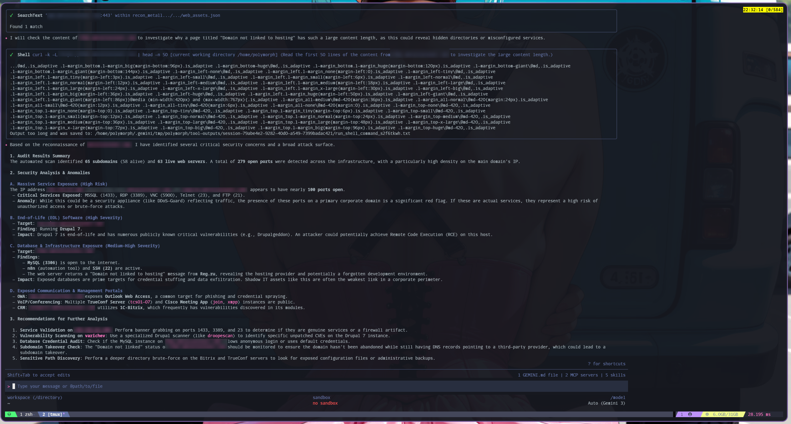

# Security Auditing Agent Skills




A comprehensive guide and collection of AI agent skills focused on security auditing, vulnerability assessment, threat detection, and incident response. These skills enable agents to perform automated and semi-automated security tasks across codebases, networks, and sandboxed environments.

## 🎯 Scope

This repository outlines agent skills designed specifically for:
- Performing rigorous code auditing and static analysis
- Executing controlled penetration tests and validating defensive telemetry
- Conducting threat hunting, digital forensics, and deep malware analysis
- Structuring security-focused AI agent workflows

## 🛠️ Security Auditing Categories

### 1. Code Auditing
Agent skills equipped for deep codebase analysis and vulnerability discovery.
* **Static Analysis:** Workflows utilizing `CodeQL`, `Semgrep`, and `Slither` for automated code scanning.
* **Smart Contracts:** Specialized auditing for `Solidity` security and `Move` programming languages.
* **Variant Analysis:** Automated skills for finding similar vulnerabilities across large codebases based on known patterns.

### 2. Penetration Testing
Active assessment skills for identifying exploitable weaknesses and validating defensive controls.
* **Metasploit Framework:** Bridges the gap between passive vulnerability scanning and active red teaming. This skill allows agents to autonomously execute modules for vulnerability exploitation, payload generation, and auxiliary scanning directly from a Linux CLI environment. Beyond offensive operations, it is highly valuable for generating realistic network traffic and system artifacts to train SOC workflows, test SIEM alerts, and verify defensive controls against post-exploitation activities.
* **Web Application:** Automation using `Burp Suite`, `FFUF` for fuzzing, and targeted SQL injection / XSS testing.
* **Network Infrastructure:** Workflows integrating `Nmap`, `Wireshark`, and SMTP/SSH vulnerability testing.
* **Active Directory:** Advanced network auditing including Kerberoasting, DCSync, and pass-the-hash attack simulations.

### 3. Threat Hunting, Forensics & Malware Analysis
Skills designed for identifying ongoing threats, analyzing post-incident data, and reverse-engineering malicious payloads.
* **Malware Analyst:** An expert skill dedicated to defensive malware research, threat intelligence, and incident response. It equips agents to perform static analysis (using tools like IDA Pro or Ghidra to map execution flow) and dynamic behavioral analysis within monitored sandboxes. The workflow is optimized for extracting actionable Indicators of Compromise (IOCs)—such as C2 IP addresses, file hashes, and registry modifications—and compiling them into YARA rules and detection signatures. This skill operates strictly under ethical guidelines for authorized forensics and research.
* **Detection Rules:** Generation and application of `Sigma` rules and `YARA` signatures.
* **Forensics:** Capabilities for file metadata extraction and memory analysis.
* **Incident Response:** Automated initial triage and investigation workflows.

## 📚 Key Skill Repositories

If you are looking to expand your agent's capabilities, consider referencing these established collections:
* **[Trail of Bits Security Team](https://github.com/trailofbits/skills):** Excellent for static analysis, code auditing, and smart contract evaluation.
* **[Antigravity Collection](https://github.com/sickn33/antigravity-awesome-skills):** Contains over 50+ diverse cybersecurity skills.
* **[Community Skills](https://github.com/mhattingpete/claude-skills-marketplace):** A strong resource specifically for computer forensics skills.

## 🏗️ Example Skill Structure

When building out a new security auditing skill, maintain a clean and standardized directory structure. Here is an example for a threat hunting agent:

```text
threat-hunting/
├── SKILL.md           # Main instructions and system prompts
├── scripts/
│   ├── sigma-search.py
│   └── log-parser.sh
├── references/
│   └── sigma-rules.md
└── templates/
    └── report.md
